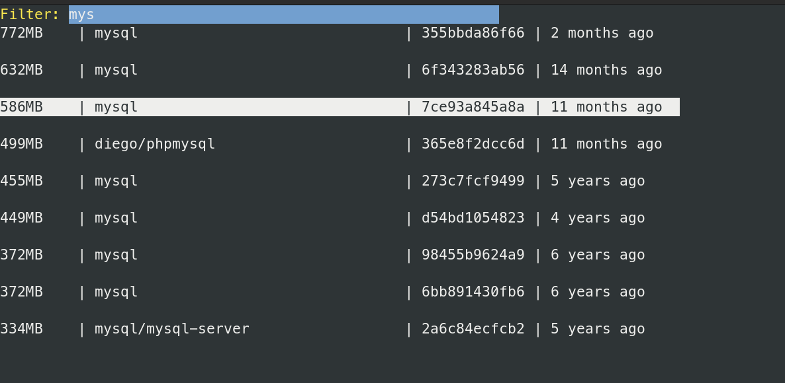
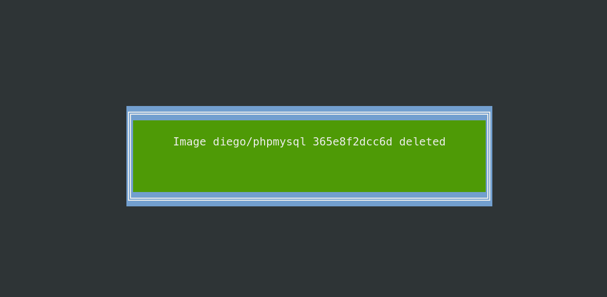
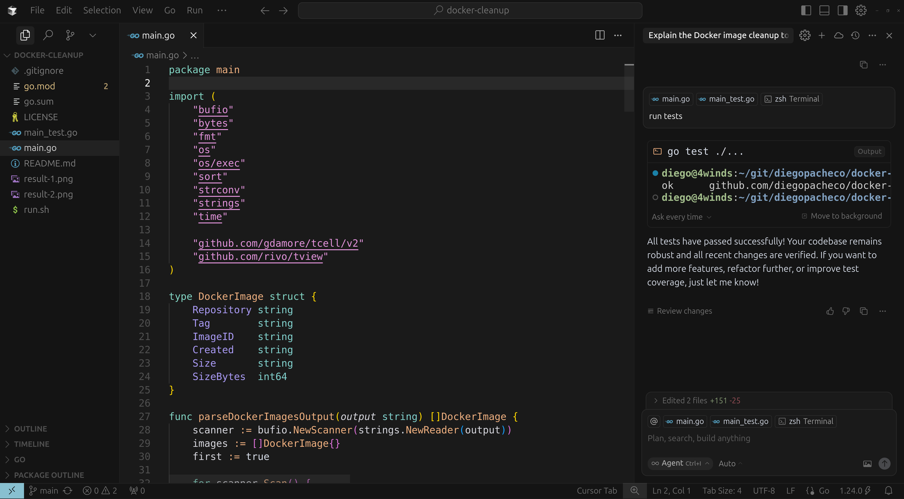

# docker-cleanup

Simple Go CLI tool to clean up Docker images by searching for images and deleting them interactively.

### Run

```bash
./run.sh
```

### Result

Docker Clean Up: Search for image(press enter to delete) <br/>


Delete image: <br/>


### Fun Fact

Running on my machine, was able to save `53GB` of disk space by deleting unused Docker images.

### Developed using Cursor

Cursor (https://www.cursor.com/) in Action 
 <br/>

PROS

* Free Tier :-) 
* Cursor is a FORK of VSCode
* It works
* Can run tests from prompt
* Provide DIFFs before applying
* Can ask questions
* Has Agentic Mode

CONS
* Slower than Original VS Code in Linux
* Crashed in Linux
* Moving around is not super smooth
* Most of this feature Copilot for VS Code already have it (yes they copy from cursor)
* I asked cursor to generate tests, the tests was bad because did not test my app, so I had to ask again and point whats was wrong.

### Related POCs

* Anthropic Claude Code https://github.com/diegopacheco/claude-code-poc
* OpenAI Codex: https://github.com/diegopacheco/codex-poc
* Google Jules https://github.com/diegopacheco/google-jules-poc
* Gemini-cli POC: https://github.com/diegopacheco/gemini-cli-poc
* Sketch POC: https://github.com/diegopacheco/sketch-dev-poc
* Augument Code POC: https://github.com/diegopacheco/augmentcode-poc
